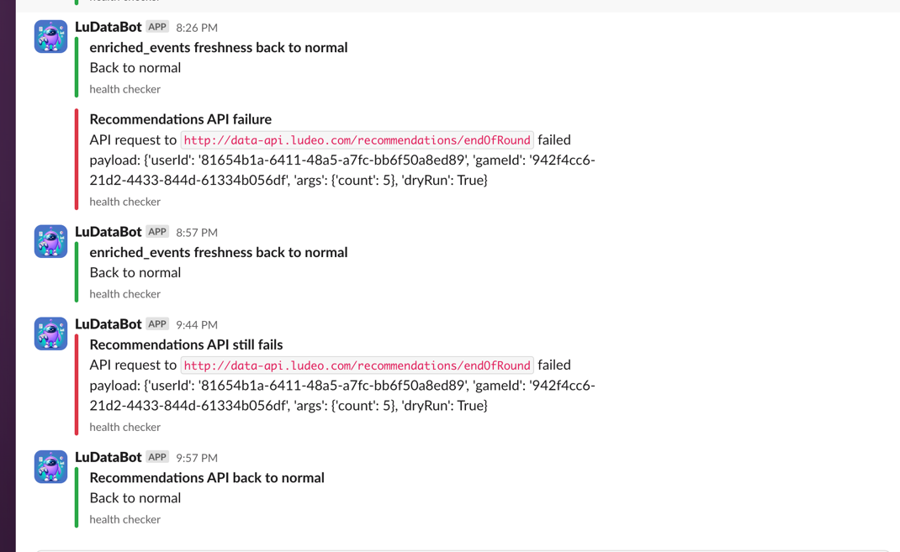

# Health Checker
checking the health of our services/tasks:

* Recommendation API
* datalake freshness (enriched_events iceberg table)

Features:
* In case of task failure, send a slack alert message to dedicated channel
  * if failure continues more than X minutes - alert again
* When health check back to normal - send slack "back to normal" message

Alerts for Example:

### structure
#### config
`config.py` contains the configuration of all tasks including: task_id, health_check_func, success_title, failure_title

#### tasks
all tasks found in `/tasks` contains the actual code we run for each health check. each task should have a the health_check_func with name:
`health_check_{task_name}` that should return:
* if health check is success -> return empty list
* if health check is failed  -> return list of messages to send in slack

#### main
`main.py` get all tasks to run from config and run them. 
in case of failure, send a slack message to the dedicated channel.

### Add a new health check
* add a new task code in `/tasks` folder - will run the check and return:
  * empty list if task is healthy
  * list with error messages to show in slack alert
* add the new task config to `config.py`